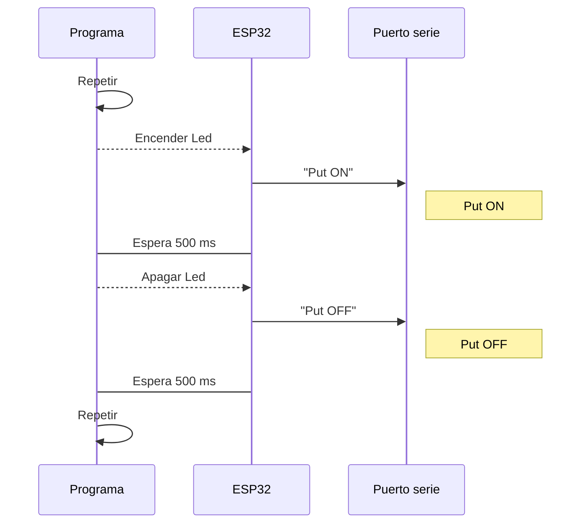
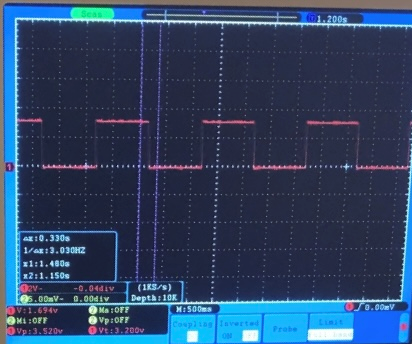

#### Oriol Garcia Vila
# INFORME PRÀCTICA 1: BLINK
___ 
### Part 1:

1. CODIGO USADO:
~~~cpp 
#include <Arduino.h>

#define LED 16

void setup() {
  // put your setup code here, to run once:
Serial.begin(9600);
pinMode(LED,OUTPUT);
}

void loop() {
  // put your main code here, to run repeatedly:
  digitalWrite(LED,HIGH);
  Serial.println("PUT ON");
  delay(1000);
  Serial.println("PUT OFF");
  digitalWrite(LED,LOW);
  delay(1000);
} 
~~~

  2. DIAGRAMA DE FLUJO:

3. CRONOGRAMA:

 

> Imágen del osciloscopio, ON, 500ms, OFF

### TIME OFF PROCESSADOR:
- el tiempo libre que tiene el processador es de 500 ms entre el LED ON i LED OFF

